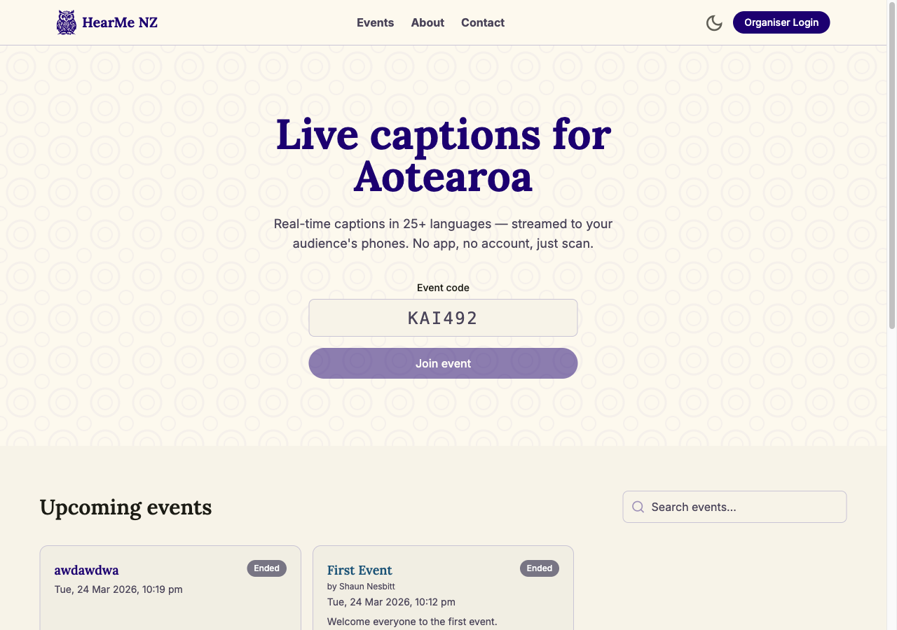
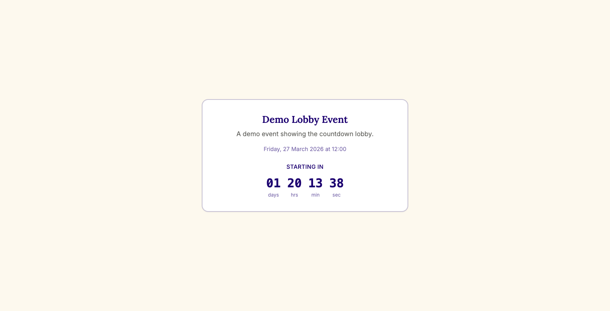
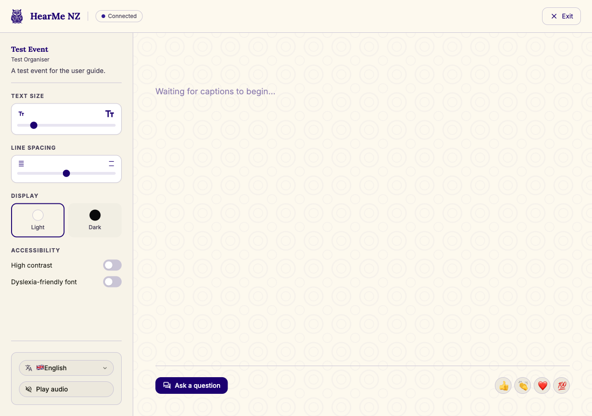
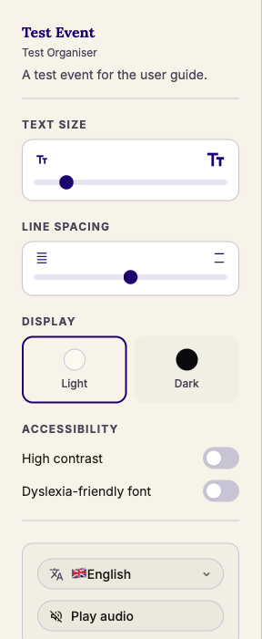
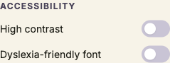
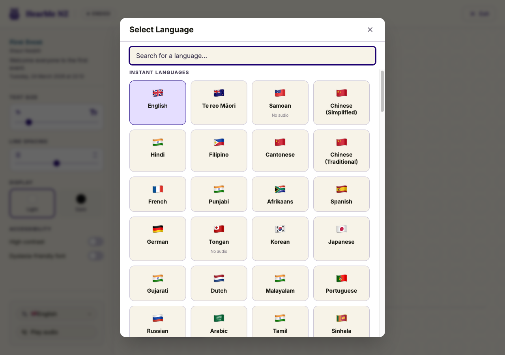
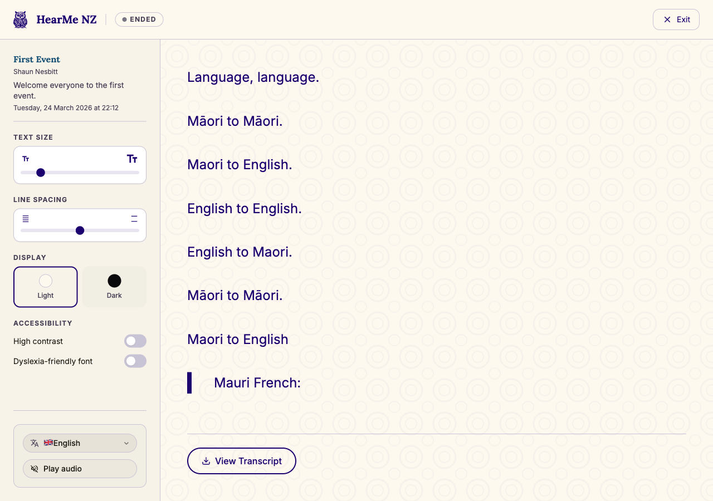
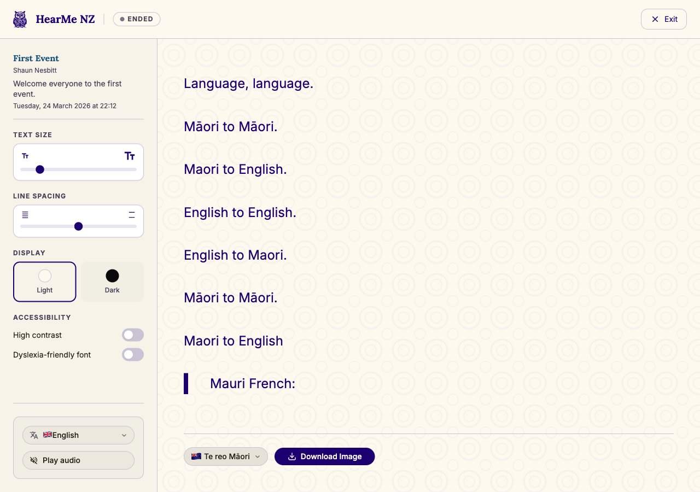

# HearMe NZ — Audience Guide

This guide explains how to join an event and get the most out of the live caption screen — including language selection, accessibility options, asking questions, and downloading the transcript after the event.

---

## 1. Finding an event

Go to the HearMe NZ home page. You have two ways to find an event:

**Option 1 — Enter an event code**

In the hero section, enter the **6-character event code** given to you by the organiser (e.g. `KAI492`) into the **Event code** field. The code is automatically uppercased. Click **Join event**.

> **Where to find the event code:** Your organiser will share it verbally, display it on screen, or send you a direct link. If you received a link, you don't need to enter a code — just follow it.

**Option 2 — Browse upcoming events**

Scroll down to the **Upcoming events** section. Use the **Search events** box to filter by name, or browse the grid of event cards. Live events appear at the top (green "Live" badge), followed by upcoming and ended events. Click any card to go directly to that event.

If the event is not found with a code: inline error `"Event not found. Check the code and try again."` will appear below the input field.

---

## 2. The event lobby

If the event has a scheduled start time in the future, you will see the **event lobby**.

The lobby shows:
- The event title and description
- The scheduled start date and time
- A live countdown: days, hours, minutes, and seconds

When the session goes live, the screen will automatically switch to the caption view. There is no need to refresh the page.

---

## 3. Watching captions

Once the session starts, captions appear in real time in the main area of the screen.

The **status badge** in the header tells you what is happening:

| Badge | Meaning |
|-------|---------|
| Green pulsing dot + **Live** | Session is active — captions are streaming |
| **Connected** | You are connected and waiting for the session to start |
| **Connecting…** | Establishing connection to the server |
| **Ended** | The session has finished |

To leave the event at any time, click the **Exit** button in the top right corner.

---

## 4. Customising your view

On the left side of the screen you will find settings to personalise your caption experience.

**On mobile:** tap the settings icon (three horizontal lines with sliders) in the top left to open the settings panel.

### Text size

Drag the slider to make captions larger or smaller. The range goes from compact to very large — find whatever is easiest for you to read across the room.

### Line spacing

Drag the slider between **compact**, **normal**, and **relaxed** to adjust the space between caption lines.

### Display

Click **Light** or **Dark** to switch the colour scheme.

### Accessibility

- **High contrast** — switches to high-contrast black-and-white captions. Useful in bright rooms or for readers who find the coloured theme harder to follow.
- **Dyslexia-friendly font** — switches the caption text to the OpenDyslexic font, which is designed to reduce reading errors for people with dyslexia.

Both settings are toggles — tap once to turn on, tap again to turn off.

### Language

Click the **language button** (showing your current language with its flag) to open the language picker.

Choose any of the supported NZ census languages. Captions are translated in real time — there is no delay waiting for a human translator.

Your language choice is saved automatically, so next time you visit you will see captions in the same language.

### Audio

If a spoken audio version is available for your selected language, a **"Play audio"** button appears below the language picker.

Tap it to hear each caption spoken aloud as it arrives — useful if you want to listen rather than read, or if you want audio in a language other than the one being spoken.

Tap **"Audio on"** to turn audio playback off.

> **Note:** Audio is available for a subset of languages. If the button does not appear, spoken audio is not currently supported for your selected language.

---

## 5. Asking questions

While the event is live, you can send a question to the presenter.

Tap **Ask a question** at the bottom of the screen.

Type your question (up to 280 characters). Then either:
- Tap the **Send** button, or
- Press **Cmd + Enter** (Mac) or **Ctrl + Enter** (Windows/Android)

Your question is submitted in your chosen language and automatically translated for the presenter. Tap the **×** or anywhere outside the drawer to close it without sending.

**Reactions:** Tap any of the emoji buttons at the bottom right — 👍 👏 ❤️ 💯 — to send a live reaction. These float up on the presenter's screen.

---

## 6. Downloading the transcript

After the event has ended, a **View Transcript** button appears at the bottom of the caption screen.

1. Click **View Transcript** to load the processed transcript.
2. Select a **language** from the picker — all languages configured for this event are available.
3. Click **Download Image** to save the transcript as a PNG image to your device.

The downloaded file is named after the event and includes the event title, date, language, and full caption text.

---

## Quick reference

| Task | How |
|------|-----|
| Join an event | Home page → enter 6-character code → Join event |
| Change caption language | Settings sidebar → Language button → pick a language |
| Make text bigger | Settings sidebar → Text Size slider → drag right |
| Switch to dark mode | Settings sidebar → Display → Dark |
| Turn on high contrast | Settings sidebar → Accessibility → High contrast toggle |
| Enable dyslexia font | Settings sidebar → Accessibility → Dyslexia-friendly font toggle |
| Ask the presenter a question | "Ask a question" button → type → Send |
| Send a reaction | Tap 👍 👏 ❤️ or 💯 at the bottom of the screen |
| Download the transcript | After event ends → View Transcript → pick language → Download Image |
| Exit the event | Exit button in the top right corner |
