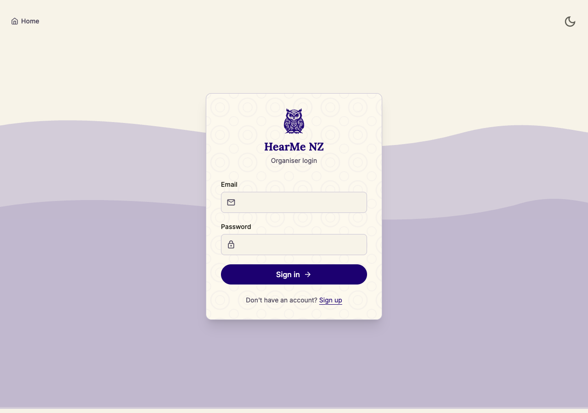
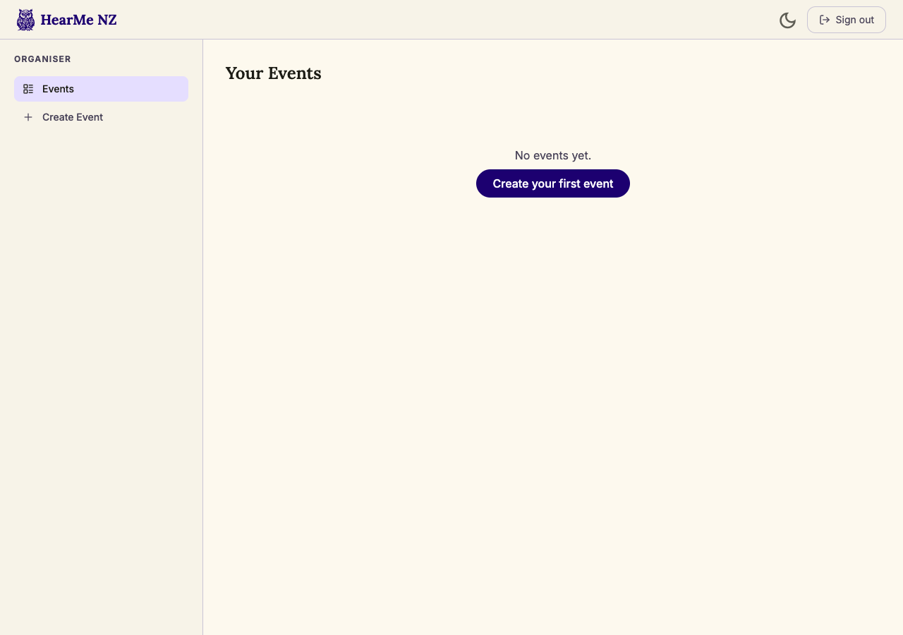
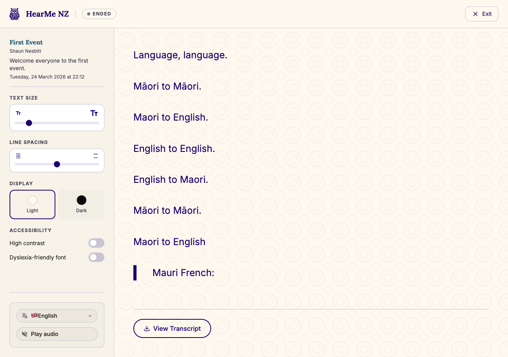
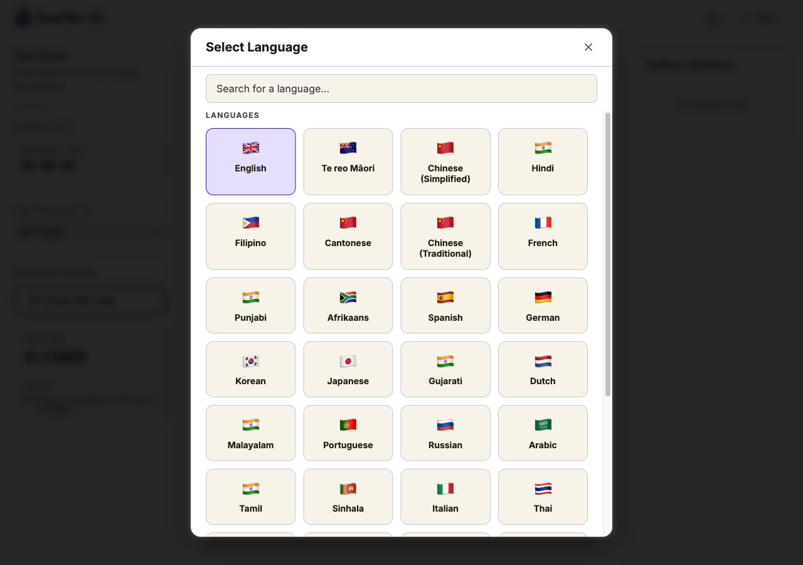
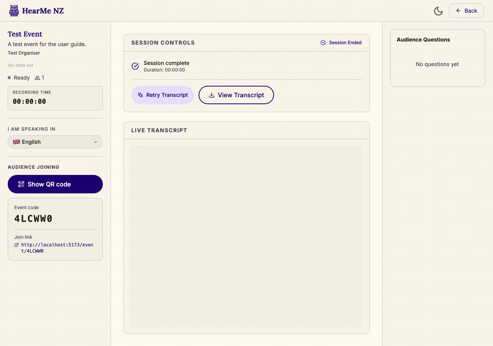
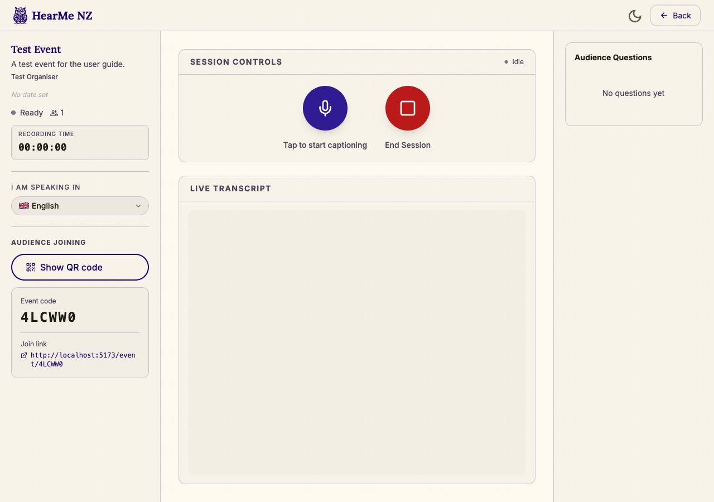
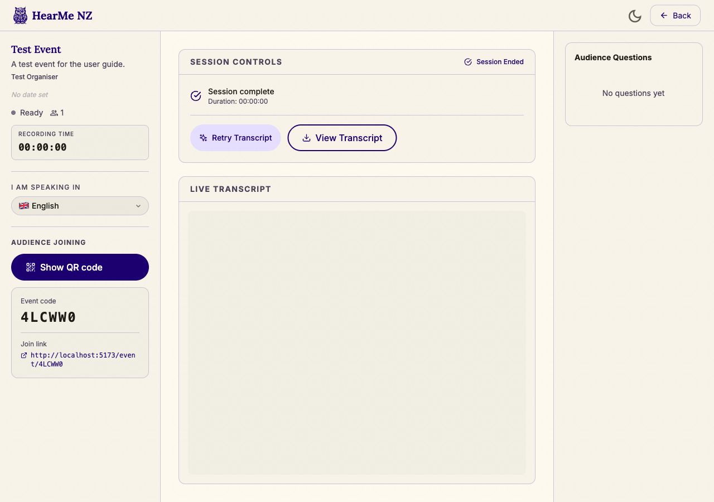

# HearMe NZ — Presenter Guide

This guide covers everything you need to run a live captioning session: signing in, creating an event, presenting, and downloading the transcript afterwards.

---

## 1. Sign up and log in

Go to `/login` from the home page (top-right corner).

Enter your **Email** and **Password**, then click **Sign in**.

**First time?** Click **Sign up** below the form. Enter your email and a password (minimum 8 characters). After submitting, you will see a **"Check your email"** screen — click the confirmation link in your inbox to activate your account, then return to `/login` to sign in.

---

## 2. Your dashboard

After signing in you land on **Your Events**.

Events are sorted by status: **Live** → **Upcoming** → **Ended**. Click any event card to open that event's presenter view.

The left sidebar has two links:
- **Events** — returns to this dashboard
- **Create Event** — opens the event creation form

---

## 3. Create an event

Click **Create Event** in the sidebar or navigate to `/create`.

Fill in the details:

| Field | Required | Notes |
|-------|----------|-------|
| **Event title** | Yes | Shown to your audience on the caption screen |
| **Description** | No | Shown in the audience settings sidebar |
| **Organiser / speaker name** | No | Displayed below the event title for your audience |
| **Theme colour** | No | Choose from 7 NZ-inspired presets: Default, Tūī, Pōhutukawa, Kōwhai, Pounamu, Tohorā, Kōrari |
| **Custom phrases** | No | Comma-separated words to improve speech recognition accuracy — useful for te reo Māori words, names, and event-specific terms (e.g. `karakia, whakatau, kaiārahi`) |
| **Event date** | No | Sets the session start time; your audience will see a countdown lobby until this time |

Click **Create event**. You are taken directly to the presenter view.

---

## 4. Running a session

### 4a. Event information

The left sidebar shows your event details.

Hover over any field (title, description, organiser name, date) to reveal a **pencil icon**. Click it to edit the field inline. Press the **check mark** to save, or **×** to cancel.

The **status indicator** shows:
- Red pulsing dot + "Live" — audio is being captured and streamed
- Grey dot + "Ready" — idle, not yet recording

The **viewer count** (person icon + number) appears when audience members join.

The **Recording Timer** counts up from `00:00:00` while the microphone is active.

---

### 4b. Choosing your language

Under **"I am speaking in"**, click the language button to open the language picker.

Select the language you will speak in. If your event is configured with both English and te reo Māori, an **"English + Te Reo"** dual-mode option is available at the bottom of the list.

---

### 4c. Sharing with your audience

Scroll down in the left sidebar to the **Audience Joining** section.

You have three ways to share:

- **QR code** — audience members scan this with their phone camera to go directly to the caption screen. Display it on a screen or projector.
- **Event code** — the 6-character code (e.g. `KAI492`). Read it aloud or display it. Audience members enter it at `hearme.nz`.
- **Join link** — the full URL (e.g. `hearme.nz/event/KAI492`). Share via message, email, or slide.

---

### 4d. Starting and stopping

The **Session Controls** panel is in the main area.

| Button | Action |
|--------|--------|
| **Microphone button** (first click) | Starts audio capture. Status changes to "Streaming". Captions begin flowing to your audience. |
| **Microphone button** (second click) | Pauses capture. Captions stop but the session remains open — you can restart at any time. |
| **Red square — End Session** | Permanently ends the event. Captions stop, the session is marked as ended, and you move to the post-session view. |

> **Note:** Pausing the microphone does not end the session. Use End Session only when the event is complete.

---

### 4e. Live transcript

The **Live Transcript** panel fills the main area below Session Controls.

This mirrors what your audience is seeing. Captions appear in the source language you selected.

Audience emoji reactions (👍 👏 ❤️ 💯) float upward briefly in this panel when sent.

---

### 4f. Audience Q&A

On large screens the **Q&A panel** is visible on the right side of the screen.

On smaller screens, click the **Q&A** button in the Session Controls header.

Questions submitted by audience members appear here, automatically translated into your event language. You can:
- **Pin** a question to keep it at the top
- **Dismiss** a question to remove it from the queue

The Q&A button shows a badge count when there are unanswered questions.

---

## 5. After the session

After clicking **End Session**:

1. A **Session complete** message shows the total recording duration.

2. Click **Generate Transcript (AI Assist)** — HearMe NZ uses AI to clean and format the transcript from the raw caption data. The button shows "Processing…" while it runs (typically 15–60 seconds).

3. Once processing completes, the button changes to **Regenerate Transcript** if you want a fresh version.

4. Click **View Transcript** to load the transcript, then:
   - Select a **language** from the picker — all NZ census languages your event was configured for are available.
   - Click **Download Image** to save the transcript as a PNG file to your device.

> **Tip:** The AI Assist step cleans filler words, fixes punctuation, and formats the transcript for readability. You can run it multiple times if needed.

---

## Quick reference

| Task | How |
|------|-----|
| Edit event title during session | Hover title in left sidebar → pencil icon |
| Share event with audience | QR code or event code in "Audience Joining" section |
| Pause captions without ending event | Click mic button again (stops streaming, keeps session open) |
| End event permanently | Red square "End Session" button |
| Generate transcript | Post-session → "Generate Transcript (AI Assist)" |
| Download transcript | Post-session → "View Transcript" → pick language → "Download Image" |
| Switch dark/light mode | Sun/moon icon in header |
